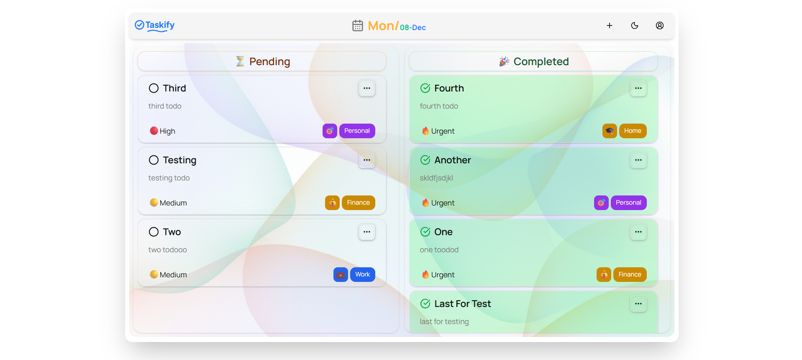
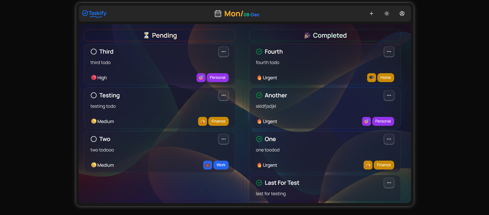
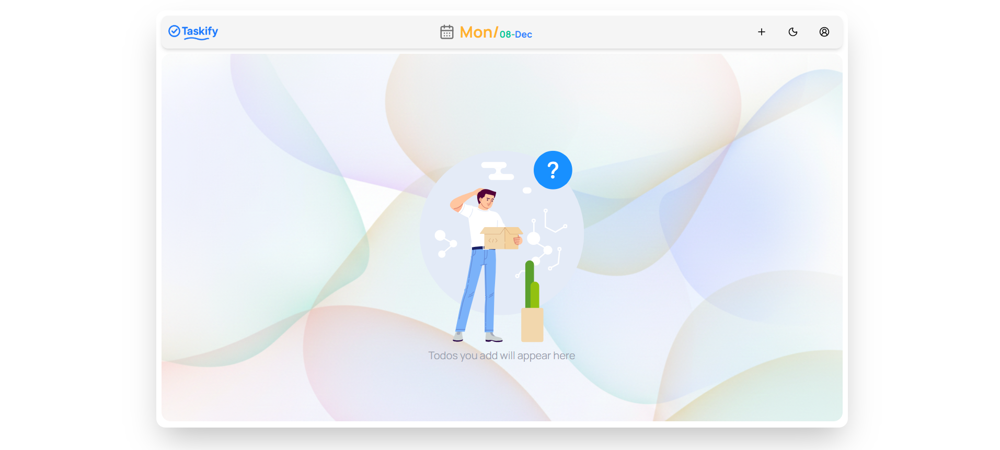
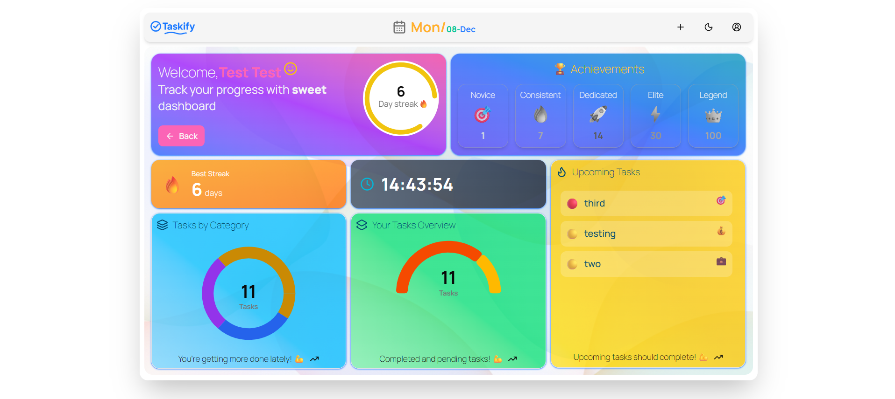
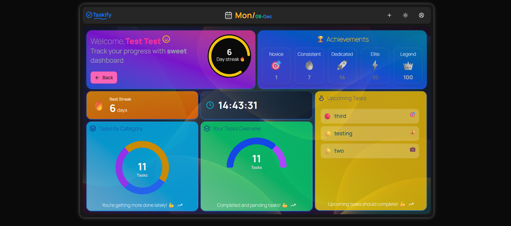
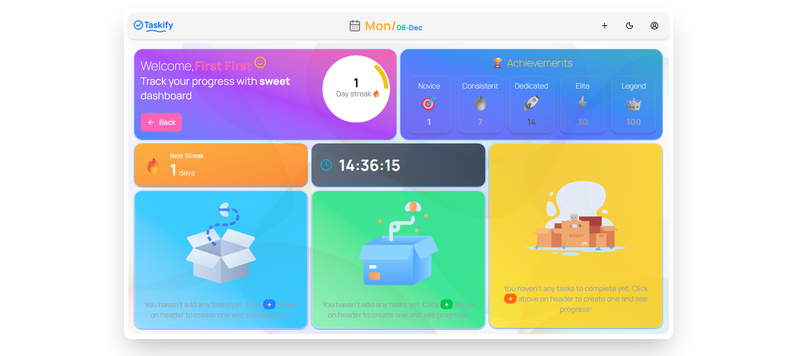
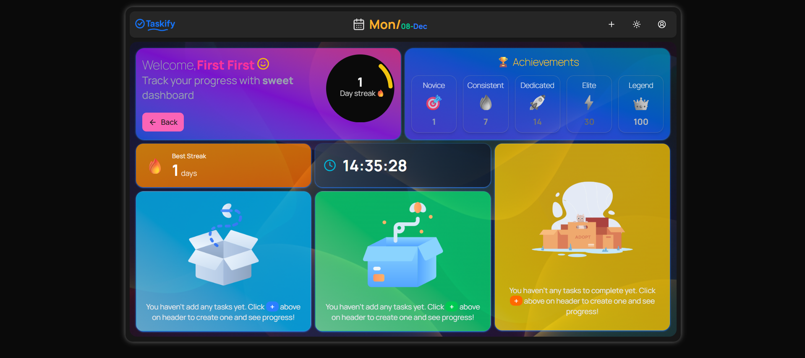
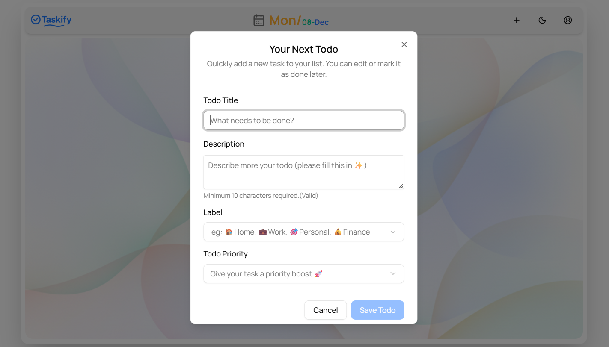
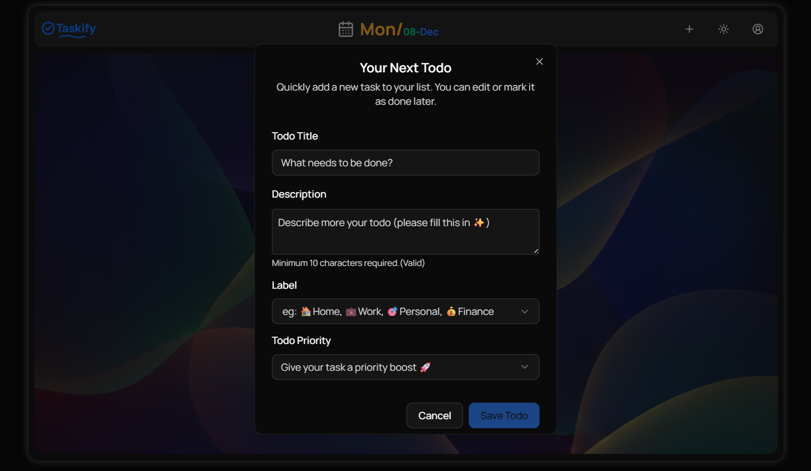

# ✅ Taskify

A personal productivity app for managing your daily tasks with a polished dashboard, streak tracking, and smart categorization.



---

## 📸 Screenshots

### 🏠 Home Page

| Light Mode                                                                | Dark Mode                                                                  |
| ------------------------------------------------------------------------- | -------------------------------------------------------------------------- |
|  |  |

### 📊 Dashboard

| Light Mode                                                                            | Dark Mode                                                                           |
| ------------------------------------------------------------------------------------- | ----------------------------------------------------------------------------------- |
|  |  |

### 📭 Empty States

| Light Mode                                                                      | Dark Mode                                                                     |
| ------------------------------------------------------------------------------- | ----------------------------------------------------------------------------- |
|  |  |

### ➕ Add Todo Dialog

| Light Mode                                                           | Dark Mode                                                          |
| -------------------------------------------------------------------- | ------------------------------------------------------------------ |
|  |  |

---

## ✨ Features

### 📝 Todo Management

- Create, read, update, and delete todos
- Each todo has a title, description, category, and priority
- Mark todos as done or pending with one click
- Todos are sorted by priority level in both sections

### 🗂️ Categories

- Create your own custom categories with a name, icon, and color
- Edit and delete categories
- Categories are personal — each user manages their own

### 🎯 Priority System

- Pre-defined priority levels: Emergency, High, Medium, Low
- Each priority has its own color and icon
- Todos are automatically sorted by priority

### 📊 Dashboard (7 sections)

- **Day Streak** — tracks how many consecutive days you've completed tasks
- **Achievements** — unlock badges: Novice (1), Consistent (7), Dedicated (14), Elite (30), Legend (100)
- **Longest Streak** — your best streak ever recorded
- **Live Clock** — real-time clock display
- **Tasks by Category** — donut chart showing task distribution across categories
- **Tasks Overview** — radial chart showing completed vs pending ratio
- **Upcoming Tasks** — list of your pending todos still to complete

### 🌗 Light & Dark Mode

- System-aware theme by default
- Toggle between light and dark mode from the navbar

### 🔐 Authentication

- Secure sign-in and sign-up via Clerk
- Multi-tenant support — each user has their own isolated data

---

## 🛠️ Tech Stack

| Category         | Technology                                      |
| ---------------- | ----------------------------------------------- |
| Framework        | [Next.js 16](https://nextjs.org/) (App Router)  |
| Language         | [TypeScript](https://www.typescriptlang.org/)   |
| Styling          | [Tailwind CSS v4](https://tailwindcss.com/)     |
| UI Components    | [shadcn/ui](https://ui.shadcn.com/)             |
| Animations       | [Framer Motion](https://www.framer.com/motion/) |
| Charts           | [Recharts](https://recharts.org/)               |
| State Management | [Redux Toolkit](https://redux-toolkit.js.org/)  |
| ORM              | [Prisma](https://www.prisma.io/)                |
| Database         | [Neon PostgreSQL](https://neon.tech/)           |
| Authentication   | [Clerk](https://clerk.com/)                     |
| Deployment       | [Vercel](https://vercel.com/)                   |

---

## 🚀 Getting Started

### Prerequisites

- Node.js 18+
- A [Neon](https://neon.tech/) database
- A [Clerk](https://clerk.com/) account

### Installation

```bash
# 1. Clone the repository
git clone https://github.com/AbdelAli-none/taskify.git
cd taskify

# 2. Install dependencies
npm install

# 3. Set up environment variables
cp .env.example .env
```

### Environment Variables

Create a `.env` file in the root with the following:

```env
# Database
DATABASE_URL="postgresql://..."

# Clerk Authentication
NEXT_PUBLIC_CLERK_PUBLISHABLE_KEY=pk_...
CLERK_SECRET_KEY=sk_...
NEXT_PUBLIC_CLERK_SIGN_IN_URL=/sign-in
NEXT_PUBLIC_CLERK_SIGN_UP_URL=/sign-up

# Weather (optional)
NEXT_PUBLIC_OPENWEATHER_API_KEY=your_key_here
```

### Database Setup

```bash
# Generate Prisma client
npx prisma generate

# Run migrations
npx prisma migrate dev --name init

# Seed priorities (optional)
npx prisma db seed
```

### Run the App

```bash
# Development
npm run dev

# Production build
npm run build
npm run start
```

Open [http://localhost:3000](http://localhost:3000) in your browser.

---

## 📁 Project Structure

```
taskify/
├── src/
│   └── app/
│       ├── actions/          # Server actions (todo, category, priority)
│       ├── dashboard/        # Dashboard page
│       └── page.tsx          # Home page
├── components/               # React components
│   ├── ui/                   # shadcn UI primitives
│   ├── CardTodo.tsx
│   ├── Dashboard.tsx
│   ├── Navbar.tsx
│   └── ...
├── lib/
│   ├── features/             # Redux slices
│   └── prisma.ts             # Prisma client
├── prisma/
│   └── schema.prisma         # Database schema
└── public/                   # Static assets
```

---

## 🗄️ Database Schema

```
User
 ├── has many Todos
 │      ├── belongs to one Category (user-owned)
 │      └── belongs to one Priority (global)
 └── has many Categories
```

---

## 🙏 Acknowledgements

- [shadcn/ui](https://ui.shadcn.com/) for the beautiful component library
- [Clerk](https://clerk.com/) for seamless authentication
- [Neon](https://neon.tech/) for serverless PostgreSQL
- [Vercel](https://vercel.com/) for hosting

---

## 👨‍💻 Author

**AbdelAli** — [@AbdelAli-none](https://github.com/AbdelAli-none)

---

## 📄 License

This project is open source and available under the [MIT License](LICENSE).

---

<p align="center">Crafted with ❤️ & lots of ☕ · © 2026</p>
